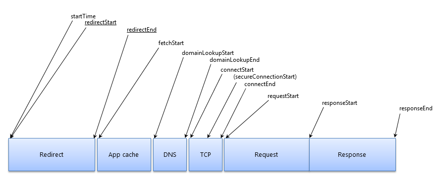

# 前端监控

## 技术监控

- 页面性能监控
  - `performance.timing`
- 静态资源性能监控
    - `performance.getEntries()`
- 错误监控
- 接口性能监控

## 行为监控

- 用户行为路径
- 打点监控
  - 监控页面中功能使用频率
- `log`上报策略
- 时效策略

## `performance.timing`
页面加载时间顺序


| 参数                       | 含义                       | 默认值                            | 备注        |
| -------------------------- | -------------------------- | --------------------------------- | ----------- |
| navigationStart            | 前一个网页卸载的时间       | fetchStart                        |             |
| unloadEventStart           | 前一个网页的unload事件开始 | 0                                 |             |
| unloadEventEnd             | 前一个网页的unload事件结束 | 0                                 |             |
| **Redirect**               |                            |                                   |             |
| redirectStart              | 重定向开始时间             | 0                                 | 需要同域    |
| redirectEnd                | 重定向结束时间             | 0                                 | 需要同域    |
| **App cache**              |                            |                                   |             |
| fetchStart                 | 开始请求网页               |                                   |             |
| **DNS**                    |                            |                                   |             |
| domainLookupStart          | DNS查询开始                | fetchStart                        |             |
| domainLookupEnd            | DNS查询结束                | fetchStart                        |             |
| **TCP**                    |                            |                                   |             |
| connectStart               | 向服务器建立握手开始       | fetchStart                        |             |
| (secureConnetionStart)     | https握手开始              | 0                                 | 非https没有 |
| connectEnd                 | 建立握手结束               | fetchStart                        |             |
| **Request**                |                            |                                   |             |
| requestStart               | 向服务器发送请求开始       |                                   |             |
| responseStart              | 响应式开始                 |                                   |             |
| responseEnd                | 响应结束                   |                                   |             |
| **DOM**                    |                            |                                   |             |
| domLoading                 | 解析DOM开始                | document.readyState为 loading     |             |
| domInteractive             | 解析DOM结束                | document.readyState为 interactive |             |
| DOMContentLoadedEventStart | ContentLoaded开始          |                                   |             |
| DOMContentLoadedEventEnd   | ContentLoaded结束          |                                   |             |
| domComplete                | 文档解析完成               |                                   |             |
| loadEventStart             | load事件前                 |                                   |             |
| loadEventEnd               | load事件后                 |                                   |             |


```js
Performance 
memory: MemoryInfo {totalJSHeapSize: 7740041, usedJSHeapSize: 7081361, jsHeapSizeLimit: 4294705152},
navigation: PerformanceNavigation {type: 1, redirectCount: 0},
onresourcetimingbufferfull: null
timeOrigin: 1592043218678.9648
timing: PerformanceTiming
    connectEnd: 1592043218679
    connectStart: 1592043218679
    domComplete: 1592043222527
    domContentLoadedEventEnd: 1592043222121
    domContentLoadedEventStart: 1592043222016
    domInteractive: 1592043222016
    domLoading: 1592043219082
    domainLookupEnd: 1592043218679
    domainLookupStart: 1592043218679
    fetchStart: 1592043218679
    loadEventEnd: 1592043222534
    loadEventStart: 1592043222527
    navigationStart: 1592043218677
    redirectEnd: 0
    redirectStart: 0
    requestStart: 1592043218684
    responseEnd: 1592043219406
    responseStart: 1592043219067
    secureConnectionStart: 0
    unloadEventEnd: 1592043219076
    unloadEventStart: 1592043219076
```
根据上面的时间计算出我们想要的时间差值
```js
let data = {
    prevPage: p.fetchStart - p.navigationStart, // 上一个页面的时间
    redirect: p.redirectEnd - p.redirectStart, // 重定向时间
    dns: p.domainLookupEnd - p.domainLookupStart, //DNS查询时间
    tcp: p.connectEnd - p.connectStart, // tcp连接时间
    network: p.connectEnd - p.navigationStart, // 网络总耗时
    // 网络接收时间
    send: p.responseStart - p.requestStart, // 数据从发送到接收的时间
    receive: p.responseEnd - p.responseStart, // 接收数据时间
    request: p.responseEnd - p.requestStart, // 请求页面总耗时
    // 前端渲染总耗时
    dom: p.domComplete - p.domLoading, //dom解析时间
    loadEvent: p.loadEventEnd - p.loadEventStart, // load事件执行时间
    frontend: p.loadEventEnd - p.domLoading, // 前端渲染总时间
    //
    load: p.loadEventEnd - p.navigationStart, // 页面完全加载的时间
    domReady: p.domContentLoadedEventStart - p.navigationStart, // DOM准备时间
    interactive: p.domInteractive - p.navigationStart, // DOM可交互时间
    ttfb: p.responseStart - p.navigationStart, // 首字节时间
}
```
在页面的相应事件的回调中拿到计算结果
```js
    window.addEventListener('DOMContentLoaded', () => {
      // let perfData = Util.getPerfData(performance.timing) 计算结果出错
      setTimeout(() => {
        let perfData = Util.getPerfData(performance.timing)
      }, 100)
    })

    window.addEventListener('load', () => {
      // let perfData = Util.getPerfData(performance.timing) 计算结果出错
      setTimeout(() => {
        let perfData = Util.getPerfData(performance.timing)
      }, 200)
    })
  
```
上面在相应的事件中计算结果，如果不使用`setTimeout`会出现计算错误，原因是因为计算中会需要用到相应事件完成之后的时间，而当前在事件中，所以值为`0`， 导致最后计算结果为负数